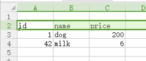

# ExcelConverter

ExcelConverter 是一个把 `.xlsx` `.xls` 文件转换为 `.json` 文件的命令行工具。


## Excel 文件格式

ExcelConverter 支持 `.xlsx` 格式的 Excel 文件，程序转换规则：

1. 只转换每个文件的第一个 **sheet**
1. 该 **sheet** 需要有一个行（**name-row**）作为 `.json` 对象的属性名——默认读取 第2行，可自定义  
    
1. **name-row** 以下的行，只读取 **name-row** 行第一个 **空白单元格** 之前的列：  
    
    **图中选中的部分，在转换过程中将被读取，并保存到`.json`文件，**

## 安装

ExcelConverter 提供常规的安装方式，具体步骤请参考 [安装方法](how-to-install-excelconverter) 文档

## 使用

1. 一般情况下，以 **待处理的Excel文件** 或者 **包含待处理Excel文件的目录** 作为参数调用，即可在每个 Excel 文件所在目录下生成结果：

	```shell
	E:\test>dir
	 Volume in drive E is Work
	 Volume Serial Number is F0BC-6B6F

	 Directory of E:\test

	2017-10-16  13:25    <DIR>          .
	2017-10-16  13:25    <DIR>          ..
	2017-10-16  12:53             8,685 data.xlsx
	2017-10-16  13:14             8,670 data2.xlsx
	               2 File(s)         17,355 bytes
	               2 Dir(s)  140,395,974,656 bytes free

	E:\test>ExcelConverter data.xlsx
	1 Succceed:[
	  "data.xlsx"
	]
	0 Failed:[]

	E:\test>dir
	 Volume in drive E is Work
	 Volume Serial Number is F0BC-6B6F

	 Directory of E:\test

	2017-10-16  13:25    <DIR>          .
	2017-10-16  13:25    <DIR>          ..
	2017-10-16  13:25                69 data.json
	2017-10-16  12:53             8,685 data.xlsx
	2017-10-16  13:14             8,670 data2.xlsx
	               3 File(s)         17,424 bytes
	               2 Dir(s)  140,395,974,656 bytes free

	E:\test>ExcelConverter e:\test
	2 Succceed:[
	  "e:\\test\\data.xlsx",
	  "e:\\test\\data2.xlsx"
	]
	0 Failed:[]

	E:\test>dir
	 Volume in drive E is Work
	 Volume Serial Number is F0BC-6B6F

	 Directory of E:\test

	2017-10-16  13:25    <DIR>          .
	2017-10-16  13:25    <DIR>          ..
	2017-10-16  13:25                69 data.json
	2017-10-16  12:53             8,685 data.xlsx
	2017-10-16  13:25                76 data2.json
	2017-10-16  13:14             8,670 data2.xlsx
	               4 File(s)         17,500 bytes
	               2 Dir(s)  140,395,974,656 bytes free

	E:\test>
	```

1. 也可以指定输出目录：


	```shell

	E:\test>dir
	 Volume in drive E is Work
	 Volume Serial Number is F0BC-6B6F

	 Directory of E:\test

	2017-10-16  13:36    <DIR>          .
	2017-10-16  13:36    <DIR>          ..
	2017-10-16  12:53             8,685 data.xlsx
	2017-10-16  13:14             8,670 data2.xlsx
	               2 File(s)         17,355 bytes
	               2 Dir(s)  140,395,974,656 bytes free

	E:\test>ExcelConverter e:\test -o=jsonFolder
	2 Succceed:[
	  "e:\\test\\data.xlsx",
	  "e:\\test\\data2.xlsx"
	]
	0 Failed:[]

	E:\test>dir
	 Volume in drive E is Work
	 Volume Serial Number is F0BC-6B6F

	 Directory of E:\test

	2017-10-16  13:37    <DIR>          .
	2017-10-16  13:37    <DIR>          ..
	2017-10-16  12:53             8,685 data.xlsx
	2017-10-16  13:14             8,670 data2.xlsx
	2017-10-16  13:37    <DIR>          jsonFolder
	               2 File(s)         17,355 bytes
	               3 Dir(s)  140,395,974,656 bytes free

	E:\test>dir jsonFolder
	 Volume in drive E is Work
	 Volume Serial Number is F0BC-6B6F

	 Directory of E:\test\jsonFolder

	2017-10-16  13:37    <DIR>          .
	2017-10-16  13:37    <DIR>          ..
	2017-10-16  13:37                69 data.json
	2017-10-16  13:37                76 data2.json
	               2 File(s)            145 bytes
	               2 Dir(s)  140,395,974,656 bytes free

	E:\test>

	```

**提示**：ExcelConverter 有多个选项供自定义处理过程，具体内容请参考 [选项说明](./doc/how_to_use_options.md) 文档