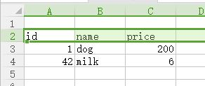
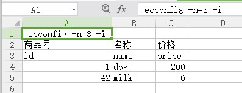

# 选项说明

ExcelConverter 有多个命令选项，以便自定义转换过程


## 选项列表

|短格式|长格式|用途|参数类型|示例|默认值|
|----:|-----:|:--:|------:|---:|:---:|
|-i|--ident|控制缩进|无| `-i` `--ident`|无缩进|
|-q|--quiet|结果输出|无| `-q` `--quiet`|输出结果|
|-k|--keep-extension|是否保留Excel文件的扩展名|无|`-k` `--keep-extension`|不保留|
|-p|--pass-postfix|忽略指定后缀的列|字符串|`-p=Server` `--pass-postfix=ClientOnly`| 无|
|-e|--erase-postfix|移除指定后缀|字符串|`-e=ClientOnly` `--pass-postfix=ClientOnly`|无|
|-n|--name-row|指定 **name-row** 的行号|整数|`-n=1` `--name-row=4`|2|
|-o|--output|指定输出目录，不存在则创建|字符串|`-o=output_dir` `-ooutput=config_dir`|每个 Excel 文件所在目录|
|-s|--stop-on-empty-row|在工作表中遇到空行就停止读取|无| `-s` `--stop-on-empty-row`|读取工作表的所有行|

## 选项详情

### -i --ident

ExcelConverter 默认不保留 `.json` 文件的缩进，以减小输出文件的容量，为便于阅读，可以使用此选项，保留缩进。  
      

以上图表格内容为示例：
```shell

E:\test>ExcelConverter data.xlsx
1 Succceed:[
  "data.xlsx"
]
0 Failed:[]

E:\test>type data.json
[{"id":1,"name":"dog","price":200},{"id":42,"name":"milk","price":6}]
E:\test>ExcelConverter -i data.xlsx
1 Succceed:[
  "data.xlsx"
]
0 Failed:[]

E:\test>type data.json
[
  {
    "id": 1,
    "name": "dog",
    "price": 200
  },
  {
    "id": 42,
    "name": "milk",
    "price": 6
  }
]
E:\test>
```

### -q --quiet

ExcelConverter 默认输出处理结果，以**成功与否**分为两类，各以一个 json 的字符串数组表示：

```shell
E:\test>ExcelConverter .
name row has no value in file:
    .\data2.xlsx
1 Succceed:[
  ".\\data.xlsx"
]
1 Failed:[
  ".\\data2.xlsx"
]

```

其中 `1 Succceed:[` 一行开始为处理结果，示例中内容表示： **1** 个文件(.\\data.xlsx)处理成功, **1** 个文件(.\\data2.xlsx)处理失败。

不需要处理结果的时候，可以使用此选项禁用它：

```shell
E:\test>ExcelConverter -q .
name row has no value in file:
    .\data2.xlsx

```

与上例处理相同的文件，使用 `-q` 选项禁用了处理结果。

**注意：**每个处理失败的文件，都有 **错误提示**， `-q` 与 `--quiet` 选项不会影响 **错误提示** 的现实。

### -k --keep-extension

ExcelConverter 默认以`.json`扩展名替换 Excel 文件的原扩展名(`.xlsx` 或 `.xls`)，如果需要保留扩展名，可以使用此选项。

```shell

E:\test>dir
 Volume in drive E is Work
 Volume Serial Number is F0BC-6B6F

 Directory of E:\test

2017-10-16  13:15    <DIR>          .
2017-10-16  13:15    <DIR>          ..
2017-10-16  13:14             8,670 data.xls
2017-10-16  12:53             8,685 data.xlsx
               2 File(s)         17,355 bytes
               2 Dir(s)  140,395,974,656 bytes free

E:\test>ExcelConverter .
2 Succceed:[
  ".\\data.xls",
  ".\\data.xlsx"
]
0 Failed:[]

E:\test>dir
 Volume in drive E is Work
 Volume Serial Number is F0BC-6B6F

 Directory of E:\test

2017-10-16  13:16    <DIR>          .
2017-10-16  13:16    <DIR>          ..
2017-10-16  13:16                69 data.json
2017-10-16  13:14             8,670 data.xls
2017-10-16  12:53             8,685 data.xlsx
               3 File(s)         17,424 bytes
               2 Dir(s)  140,395,974,656 bytes free

E:\test>ExcelConverter -k .
2 Succceed:[
  ".\\data.xls",
  ".\\data.xlsx"
]
0 Failed:[]

E:\test>dir
 Volume in drive E is Work
 Volume Serial Number is F0BC-6B6F

 Directory of E:\test

2017-10-16  13:16    <DIR>          .
2017-10-16  13:16    <DIR>          ..
2017-10-16  13:16                69 data.json
2017-10-16  13:14             8,670 data.xls
2017-10-16  13:16                76 data.xls.json
2017-10-16  12:53             8,685 data.xlsx
2017-10-16  13:16                69 data.xlsx.json
               5 File(s)         17,569 bytes
               2 Dir(s)  140,395,974,656 bytes free

E:\test>
```

示例中，文件夹下有两个文件，分别是 `data.xls` 和 `data.xlsx`，默认情况下，二者生成的结果文件名都为 `data.json`，导致其中一个结果被覆盖，使用此选项后，每个文件生成了带有各自扩展名的文件，均得以保留。

### -k --keep-extension 和 -e --erase-postfix

这两个选项功能应该相互配合，因此放在一起阐释。

**注意**：这两个选项都可以指定多次，一般来说是`-p`有这个需求。

某些时候，会需要根据同一个 Excel 文件，针对不同用途生成不同的目标 Josn 文件，比如：  
    

上图的表格中，有三个字段需要向不同的目标文件处理：

- **rateForServer**：用于服务器计算的概率值
- **rateForCllient**：用于客户端显示的概率值
- **skinForCLient**：客户端美术资源所需字段，服务器不需要它

此时使用两个选项配合：

```shell
E:\test>ExcelConverter data2.xlsx -i -p=ForServer -e=ForClient -o=clientFolder
1 Succceed:[
"data2.xlsx"
]
0 Failed:[]

E:\test>ExcelConverter data2.xlsx -i -e=ForServer -p=ForClient -o=serverFolder
1 Succceed:[
"data2.xlsx"
]
0 Failed:[]

```

可以（在不同目标文件夹）得到两个不同的（同名）文件：

**./clientFolder/data2.json**

```json
[
  {
    "id": 1,
    "name": "dog",
    "price": 200,
    "rate": 5,
    "skin": "dog-skin"
  },
  {
    "id": 42,
    "name": "milk",
    "price": 6,
    "rate": 90,
    "skin": "milk-box-skin"
  }
]
```

**./serverFolder/data2.json**

```json
[
  {
    "id": 1,
    "name": "dog",
    "price": 200,
    "rate": 10
  },
  {
    "id": 42,
    "name": "milk",
    "price": 6,
    "rate": 50
  }
]
```

### -n --name-row

ExcelConverter 默认在表格的第 **2** 行读取字段名，如果 Excel 文件的字段名在其它行，可以使用此选项指定，例如：  
    

上图中，**name-row**位于表格的第 **3** 行，使用以下命令：

    E:\test>ExcelConverter -n=3 -i data2.xlsx

可以得到正确的结果：

```json
[
  {
    "id": 1,
    "name": "dog",
    "price": 200
  },
  {
    "id": 42,
    "name": "milk",
    "price": 6
  }
]
```

### -o --output

ExcelConverter 默认把转换的结果文件输出在 Excel 文件所在目录，如果需要，可以指定输出到不同目录，用例请参考 [-k --keep-extension 和 -e --erase-postfix](#-k-keep-extension-%E5%92%8C-e-erase-postfix) 小节。

**注意**：此时，所有输入文件的处理结果都将输出到被指定的目录，如果Excel文件中有同名文件（位于不同目录下），将按照目录树遍历顺序，使用后处理的文件覆盖先处理的文件。

**指定输出文件名**：一般情况下，转化得到的目标文件与 Excel 文件同名，在特定情况下，可以指定一个不同的名字输出：

- 此时，只能指定一个输入文件，
- 此输入文件必须是一个 Excel 文档
- 指定输出路径的时候，必须以 `.josn` 作为扩展名

例如：

```shell
E:\test>dir
 Volume in drive E is Work
 Volume Serial Number is F0BC-6B6F

 Directory of E:\test

2017-10-16  15:23    <DIR>          .
2017-10-16  15:23    <DIR>          ..
2017-10-16  12:53             8,685 data.xlsx
2017-10-16  15:00             8,822 data2.xlsx
               2 File(s)         17,507 bytes
               2 Dir(s)  140,395,974,656 bytes free

E:\test>ExcelConverter data2.xlsx -o=diffName.json
1 Succceed:[
  "data2.xlsx"
]
0 Failed:[]

E:\test>dir
 Volume in drive E is Work
 Volume Serial Number is F0BC-6B6F

 Directory of E:\test

2017-10-16  15:24    <DIR>          .
2017-10-16  15:24    <DIR>          ..
2017-10-16  12:53             8,685 data.xlsx
2017-10-16  15:00             8,822 data2.xlsx
2017-10-16  15:24               141 diffName.json
               3 File(s)         17,648 bytes
               2 Dir(s)  140,395,974,656 bytes free
```

### -s --stop-on-empty-row

ExcelConverter 默认情况下会读取每个输入文件第一个 工作表(Sheet) 的所有行，并试图把每一行转化为一个 `json` 对象，如果某些行数据暂时被忽略（不需要被转化），则可以使用此选项，并确保：

1. 工作表中有一个空行，此行不填写任何数据
2. 待忽略的数据行都位于此行以下

**注意**：此选项在遇到第一个空行时生效，此行以后的数据不会读取。

## 文件选项

以上选项主要是供 ExcelConverter 可执行文件运行时指定，其中有一些选项也可以指定在文件中。

### 启用文件选项的方法

ExcelConverter 会在表格第**1**行的第**1**个单元格里，查找以 `ecconfig` 开头的字符串，如果存在，此字符串后续的内容将作为文件的选项进行读取。



上图中，通过`ecconfig`指定了两个选项，分别是 **name-row 在第3行** 和 **缩进输出内容**。

### 文件选项详情

- **`-n` `--name-row`** 如果在文件中设置了此选项，以 文件选项 最优先，可以覆盖命令行指定的值。

- **`-i` `--ident`** 如果在文件中设置了此选项，可以覆盖默认值，但如果命令行也含有此选项，则采用命令行的值。